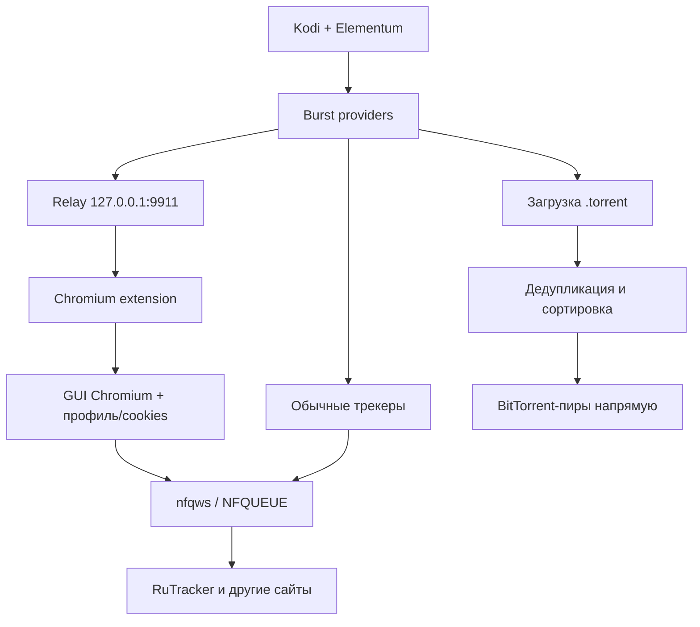

# Orange Pi 3 + LibreELEC + Elementum + RuTracker: состояние реализации

> Снимок состояния на 2026-08-03. Документ предназначен для продолжения работы в новом чате без повторного восстановления всей истории экспериментов.

## 1. Цель системы

На Orange Pi 3 под LibreELEC требуется:

- искать фильмы в Elementum/Burst по нескольким торрент-трекерам;
- получать результаты с RuTracker, несмотря на блокировку провайдером и Cloudflare Challenge;
- показывать быстрые результаты сразу, а медленные добавлять в то же окно позже;
- объединять и дедублицировать результаты, затем сортировать их по числу сидов;
- пропускать через обход блокировки только HTTP/HTTPS-доступ к трекерам;
- оставлять BitTorrent-соединения с пирами прямыми, без WARP/VPN и без потери скорости.

## 2. Текущая архитектура



Система состоит из четырёх независимых слоёв:

1. Модифицированное ядро LibreELEC с NFQUEUE/nftables.
2. Zapret/nfqws для прохождения сетевой блокировки RuTracker.
3. Полноценный GUI Chromium, который проходит Cloudflare как обычный браузер.
4. Модифицированные Burst и Elementum: браузерный мост и прогрессивная выдача результатов.

## 3. Аппаратная и системная платформа

| Параметр | Значение |
|---|---|
| Плата | Orange Pi 3, обычная версия, **не LTS** |
| SoC | Allwinner H6 |
| Архитектура | `aarch64` |
| Исходная ОС | LibreELEC official 12.0.2 `(H6.aarch64)` |
| Текущая ОС | LibreELEC community `devel-20260802060809-f3fdd11` |
| Ядро | Linux 6.6.71, aarch64 |
| Адрес устройства в локальной сети во время настройки | `192.168.31.235` |

Проверка текущей системы:

```sh
uname -a
cat /etc/os-release
```

Ожидаемый результат включает:

```text
Linux LibreELEC 6.6.71 ... aarch64 GNU/Linux
VERSION="devel-20260802060809-f3fdd11"
```

## 4. Почему понадобилась пересборка ядра

В стандартном ядре LibreELEC 12.0.2 отсутствовали необходимые компоненты NFQUEUE:

- `CONFIG_NETFILTER_NETLINK_QUEUE` был выключен;
- `CONFIG_NETFILTER_XT_TARGET_NFQUEUE` был выключен;
- `CONFIG_NF_TABLES` был выключен;
- модулей `nfnetlink_queue.ko`, `xt_NFQUEUE.ko` и `nft_queue.ko` не было.

При этом `/dev/net/tun` существовал, а `iptables` был установлен:

```text
iptables v1.8.10 (legacy)
```

Но тестовая NFQUEUE-цель завершалась ошибкой:

```text
Warning: Extension NFQUEUE revision 0 not supported, missing kernel module?
iptables: No chain/target/match by that name.
```

Это исключало запуск `nfqws` в штатной схеме Zapret. Контейнер не мог исправить отсутствие функциональности в ядре хоста, поэтому ядро пришлось пересобрать.

## 5. Среда сборки LibreELEC

Сборка выполнялась в WSL2:

| Параметр | Значение |
|---|---|
| Windows-диск WSL | `D:\\WSL\\Ubuntu-22.04` |
| Дистрибутив | Ubuntu 22.04, WSL2 |
| Пользователь | `unq` |
| Архитектура хоста сборки | `x86_64` |
| Репозиторий LibreELEC | `~/LibreELEC.tv` |
| Проект | `Allwinner` |
| Устройство | `H6` |
| Целевая архитектура | `aarch64` |

Базовая команда сборки образа:

```sh
cd ~/LibreELEC.tv
PROJECT=Allwinner DEVICE=H6 ARCH=aarch64 make image
```

Конфигурация ядра менялась в файле:

```text
projects/Allwinner/linux/linux.aarch64.conf
```

Включённые параметры:

```text
CONFIG_NETFILTER_NETLINK_QUEUE=m
CONFIG_NF_CONNTRACK_MARK=y
CONFIG_NF_TABLES=m
CONFIG_NFT_CT=m
CONFIG_NFT_QUEUE=m
CONFIG_NFT_REJECT=m
CONFIG_NFT_COMPAT=m
CONFIG_NFT_NAT=m
CONFIG_NFT_MASQ=m
CONFIG_NFT_REDIR=m
CONFIG_NETFILTER_XT_TARGET_MARK=m
CONFIG_NETFILTER_XT_TARGET_NFQUEUE=m
CONFIG_NETFILTER_XT_MATCH_CONNBYTES=m
CONFIG_NETFILTER_XT_MATCH_MARK=m
CONFIG_NETFILTER_XT_MATCH_MULTIPORT=m
CONFIG_NETFILTER_XT_MATCH_OWNER=m
```

Перед изменением создавалась резервная копия:

```text
projects/Allwinner/linux/linux.aarch64.conf.before-nfqueue
```

### 5.1. Проблемы во время сборки

Большинство сбоев были не ошибками кода LibreELEC, а проблемами источников и частично загруженными каталогами:

- недоступные или очень медленные зеркала `gmp`, `fakeroot`, `rsync`, `gcc`, `elfutils`;
- неправильная ссылка/контрольная сумма архива `squashfs-tools`;
- исчезнувший GitHub-архив `wsdd2`;
- `udevil`: отсутствующие объявления `stat` и `S_ISBLK`, сборка с `-Werror`;
- повреждённое/неполное состояние Meson для `libinput` и `dbus` (`meson-private/build.dat` отсутствовал).

Использовались рабочие зеркала MacPorts, AGL/PureOS и release-архивы с обязательной проверкой SHA256. Для Meson-пакетов удалялись только их конкретные неполные build-каталоги, после чего сборка продолжалась. Для `udevil` был добавлен необходимый системный include.

Важно: не удалять весь каталог сборки без необходимости. LibreELEC продолжает сборку с уже готовых пакетов.

### 5.2. Полученные артефакты

```text
target/LibreELEC-H6.aarch64-12.0-devel-20260802060809-f3fdd11-orangepi-3.img.gz
target/LibreELEC-H6.aarch64-12.0-devel-20260802060809-f3fdd11-orangepi-3.kernel
target/LibreELEC-H6.aarch64-12.0-devel-20260802060809-f3fdd11-orangepi-3.system
target/LibreELEC-H6.aarch64-12.0-devel-20260802060809-f3fdd11-orangepi-3.tar
```

Приблизительные размеры: образ 141 МБ, kernel 23 МБ, system 129 МБ, tar 153 МБ.

В образ действительно попали:

```text
lib/modules/6.6.71/kernel/net/netfilter/nfnetlink_queue.ko
lib/modules/6.6.71/kernel/net/netfilter/xt_NFQUEUE.ko
lib/modules/6.6.71/kernel/net/netfilter/nft_queue.ko
```

### 5.3. Проверка после установки

```sh
modprobe nfnetlink_queue
modprobe xt_NFQUEUE
modprobe nft_queue

lsmod | grep -E 'nfnetlink_queue|xt_NFQUEUE|nft_queue|nf_tables'
```

Контрольный тест:

```sh
iptables -t mangle -N NFQ_TEST
iptables -t mangle -A NFQ_TEST -j NFQUEUE --queue-num 55555
echo "RESULT=$?"
iptables -t mangle -S NFQ_TEST
iptables -t mangle -F NFQ_TEST
iptables -t mangle -X NFQ_TEST
```

На новом ядре получено `RESULT=0`, а модули присутствуют в `lsmod`.

## 6. Исследование способов обхода блокировки

### 6.1. ByeDPI

Проверялся ARM64-образ `tazihad/byedpi:v0.17.3`.

Без DPI-манипуляций SOCKS работал быстро:

```text
1 000 000 байт через Cloudflare примерно за 0,53 с
```

Но OOB-стратегия вида:

```text
-U -K tls,http -x 0 -o 1+s
```

снижала загрузку Cloudflare примерно до 777 байт/с: за 30 секунд приходило только около 23 КБ. Аналогично JavaScript Cloudflare Challenge размером около 226 КБ начинал загружаться, но практически зависал.

Вывод: некоторые стратегии формально доводили запрос до HTTP 403 Cloudflare, но ломали или резко замедляли последующую передачу больших ответов. Это не было решением для браузерного Challenge.

### 6.2. tpws

`tpws` также давал непостоянные результаты: отдельные запросы проходили, другие завершались `HTTP=000` или загружались крайне медленно. Он не был выбран как итоговая схема.

### 6.3. Cloudflare WARP

Проверялись официальный Cloudflare One Client и WARP Proxy:

- регистрация первоначально проходила только при временно включённом VPN на роутере;
- MASQUE proxy соединялся через VPN;
- без VPN зависал на endpoint и завершался `Failed to perform happy eyeballs`;
- режим WireGuard штатного клиента также не дал стабильного подключения;
- WARP добавлял нежелательную зависимость и мог ограничивать скорость.

WARP не используется в итоговой архитектуре. Это принципиально: торрент-трафик должен идти напрямую.

## 7. Итоговый сетевой обход: Zapret/nfqws

Установлен Zapret v72.13:

| Параметр | Значение |
|---|---|
| Каталог | `/storage/zapret-v72.13` |
| Размер | около 16,3 МБ |
| Исполняемый файл | `binaries/linux-arm64/nfqws` |
| Тип | статический ELF aarch64 |
| SHA256 архива | `25c74e6c5f48963fa244c2955e76694a07c39447245a0457e2efdc74b3317e68` |
| Очередь NFQUEUE | `200` |
| fwmark | `0x40000000` |

Рабочая стратегия была найдена автоматическим тестом как `general_alt11`. Проверка RuTracker дала быстрый HTTP-ответ Cloudflare:

```text
HTTP=403 bytes=5384 time=0.298
```

Это ожидаемый промежуточный результат: сетевую блокировку провайдера запрос проходит, после чего сайт уже отвечает Cloudflare Challenge.

В рабочем профиле из логов подтверждены:

```text
profile 1 multisplit abs 1
profile 1 seqovl abs 664
```

Домены берутся из:

```text
/storage/zapret-v72.13/config/rutracker-hosts.txt
```

В списке было два имени RuTracker. `cloudflare.com` в профиль не входил и проходил без модификации.

Сервис:

```text
nfqws-rutracker.service
```

Правила используют цепочки:

```text
ZAPRET_NFQ_OUT
ZAPRET_NFQ_IN
```

В очередь отправляются первые пакеты TCP/443 в обе стороны (`connbytes 1:12`), а пакеты с fwmark повторно в очередь не попадают.

Точные актуальные аргументы нельзя восстанавливать по памяти. Их всегда нужно читать с работающего Orange Pi:

```sh
systemctl cat nfqws-rutracker.service
iptables -t mangle -S ZAPRET_NFQ_OUT
iptables -t mangle -S ZAPRET_NFQ_IN
```

Диагностика:

```sh
systemctl status nfqws-rutracker.service
journalctl -u nfqws-rutracker.service -n 100 --no-pager
iptables -t mangle -L ZAPRET_NFQ_OUT -nvx
iptables -t mangle -L ZAPRET_NFQ_IN -nvx
```

## 8. Почему нужен GUI Chromium

Первоначальная диагностическая схема запускала Chromium с:

```text
--headless=new
--remote-debugging-port=...
```

и управляла им через CDP. Дополнительно менялись `navigator.webdriver`, User-Agent и другие browser API.

Cloudflare специально обнаруживает headless/автоматизированные браузеры и модификации окружения. В той схеме документ RuTracker возвращал 403, но загрузка `/cdn-cgi/challenge-platform/...` зависала, поэтому ожидание 10, 45 или 120 секунд ничего не исправляло.

Итоговая схема использует настоящий GUI Chromium:

- без headless;
- без CDP/remote debugging;
- без webdriver;
- без stealth-скриптов;
- без подмены browser API;
- без SOCKS-прокси, потому что сетевой обход выполняет nfqws на хосте;
- с `--disable-quic`, чтобы трафик шёл по TCP и попадал в NFQUEUE.

## 9. Контейнер Chromium

Используется ARM64-образ:

```text
lscr.io/linuxserver/chromium:latest
```

Основные параметры текущего контейнера:

| Параметр | Значение |
|---|---|
| Имя | `chromium-rutracker` |
| Сеть | host |
| Пользователь контейнера | `PUID=0`, `PGID=0` |
| Профиль | `/storage/.config/chromium-rutracker` -> `/config` |
| Web GUI | `https://192.168.31.235:3001` |
| Chromium | 150.0.7871.181 |
| CLI | `--disable-quic <URL RuTracker>` |

В профиле Chromium хранится авторизованная сессия RuTracker и Cloudflare clearance. Во вкладке должен быть открыт RuTracker. Браузер успешно проходит Challenge, а поиск на сайте отображает реальные результаты.

Проверка процесса:

```sh
docker inspect chromium-rutracker --format '{{json .Config.Cmd}}'
docker exec chromium-rutracker sh -c 'ps -ef | grep "[c]hromium" | head'
```

## 10. Зачем понадобился браузерный мост

Даже после того как GUI Chromium прошёл Cloudflare, обычный Python `requests` из Burst продолжал получать 403 `Just a moment...`.

Копирование cookies, включая `cf_clearance`, не помогло. Проверялись:

- обычный `requests`;
- `curl_cffi` с browser impersonation;
- тот же User-Agent, что у Chromium;
- cookies из Chromium SQLite.

Результат оставался 403, потому что Cloudflare связывает clearance не только с cookie, но и с сетевым/TLS/browser fingerprint и состоянием браузера.

Поэтому HTTP-запросы RuTracker выполняются внутри уже прошедшего проверку GUI Chromium, а Burst общается с браузером через локальный relay.

## 11. Chromium bridge

### 11.1. Файлы исходников

В репозитории `script.elementum.burst`, ветка `feature/progressive-results`:

```text
burst/client.py
burst/provider.py
scripts/rutracker-bridge/relay.py
scripts/rutracker-bridge/extension/manifest.json
scripts/rutracker-bridge/extension/background.js
scripts/rutracker-bridge/install-direct.sh
```

### 11.2. Файлы на Orange Pi

```text
/storage/.config/chromium-rutracker/rutracker-bridge
```

В контейнере этот каталог виден как:

```text
/config/rutracker-bridge
```

Relay запускается командой:

```sh
docker exec -d chromium-rutracker \
  python3 /config/rutracker-bridge/relay.py
```

Он слушает только loopback:

```text
http://127.0.0.1:9911
```

Основные endpoint:

| Endpoint | Назначение |
|---|---|
| `GET /health` | состояние relay, время последнего обращения расширения, размер очереди |
| `GET /job` | расширение забирает следующую задачу |
| `POST /result` | расширение возвращает результат |
| `POST /request` | синхронный запрос страницы для Burst/диагностики |
| `GET /torrent?url=...` | получение бинарного `.torrent` через браузер |

Проверка:

```sh
curl -sS http://127.0.0.1:9911/health
```

Рабочий ответ:

```json
{"status":"ok","extension_seen_seconds_ago":11.6,"queued_jobs":0}
```

Если `extension_seen_seconds_ago` равно `null` или постоянно растёт, расширение не общается с relay. Нужно проверить Chromium, загрузку расширения и процесс `relay.py`.

### 11.3. Принцип работы расширения

Manifest V3 extension:

1. Периодически опрашивает `/job`.
2. Для HTML-поиска находит открытую вкладку RuTracker и переводит её на нужный URL.
3. Не ждёт полной остановки индикатора загрузки: тяжёлые баннеры/ресурсы RuTracker могут грузиться долго. Достаточно появления DOM таблицы результатов.
4. После Cloudflare Challenge ждёт перехода к реальной странице.
5. Возвращает HTML relay.
6. Для `.torrent` выполняет отдельную браузерную задачу и возвращает бинарные данные в base64.

Проверено, что HTML-путь работает:

```text
status=200
title=Трекер
body_length около 275–282 КБ
forumline table найдена
topic_links=57
torrent_links=50
```

### 11.4. Важная проблема запуска

Сейчас relay не гарантированно стартует после перезапуска контейнера или Orange Pi.

Скрипт `install-direct.sh` перезапускает `chromium-rutracker`, но текущая версия не запускает `relay.py` после рестарта. В результате `/health` отвечает `Connection refused`, пока relay не запущен вручную.

Временное решение:

```sh
docker exec -d chromium-rutracker \
  python3 /config/rutracker-bridge/relay.py
```

Необходимо исправить installer и затем добавить постоянный systemd/startup hook.

## 12. Изменения Burst

Репозиторий:

```text
https://github.com/ilchenkoevgeny/script.elementum.burst
branch: feature/progressive-results
```

Установленная версия аддона: `0.0.99`.

Основные изменения:

- RuTracker search page маршрутизируется через Chromium bridge;
- найденные RuTracker-ссылки `dl.php?t=...` переписываются на локальный `/torrent?url=...`;
- результаты провайдеров отправляются пакетами, не только одним финальным массивом;
- быстрые провайдеры должны отдавать результаты раньше медленного RuTracker;
- callback содержит сообщения `results` и `done`.

Ключевые коммиты:

| Назначение | Commit |
|---|---|
| Базовый Chromium bridge | `ce7d95bf5823946637dc4a512f34a98f3095e13d` |
| Progressive provider streaming | `352e2afd97e340376620a1b0a664beac2de4e769` |
| Локальный torrent URL в provider | `8b4a90063ebddcddb6963a7984ced51843b48674` |
| `/torrent` в relay | `ca559b6d9f690e96757e3ced9bdccf889b8c510a` |
| Torrent job в extension | `114ab29a627e03af3bf504fde9516c58b2697fa0` |
| Direct installer | `859aa8a5aecadb6ed477f8588f10ecd0f2e8f15b` |

Хеши файлов, проверенные на Orange Pi 2026-08-03:

```text
provider.py   80467ec9394179761e17f4950fd7e711bfff1776f6d65d4c508388a8011a2d50
relay.py      22bf1ea18c9bf5c0f17bda7f1ca47884ac5f8fc503eb0be52fa1d9c78270315a
background.js d4bace65f7bcdbb24f16d43db60171d9e935a949b0fcf71edda17c1c4308a274
```

## 13. Изменения Elementum

Репозиторий:

```text
https://github.com/ilchenkoevgeny/elementum
branch: feature/progressive-results
```

Установленная версия: `0.1.114`, ARM64.

Основной commit реализации:

```text
2952d71f177f1f98c19e01448f3a942258952754 Show progressive movie torrent results
```

Изменённые части:

| Файл | Назначение |
|---|---|
| `providers/payload.go` | флаги progressive и timeout |
| `providers/xbmc.go` | поток callback-пакетов, timeout около 130 секунд |
| `providers/search.go` | `SearchMovieProgressive`, слияние, дедупликация, сортировка |
| `api/movies.go` | обновляемый диалог выбора торрента |
| `xbmc/xbmcgui.go` | RPC-обёртка прогрессивного диалога |

ARM64 workflow:

```text
Run ID: 30764609121
ARM64 job: 91540991482
Artifact: linux-arm64 (ID 8838564353)
```

ARM64 job прошёл успешно. Общий workflow отмечался красным только потому, что финальный job упаковки ожидал артефакты всех платформ.

Установленный бинарник:

```text
SHA256 2a42d596f8ead2bbc65670fa1a84f471e4229fd2b2d4926e0d164246c53023ce
```

Резервная копия, созданная installer на Orange Pi:

```text
/storage/elementum-progressive-backup-20260802-203709
```

## 14. Изменения plugin.video.elementum

Репозиторий:

```text
https://github.com/ilchenkoevgeny/plugin.video.elementum
branch: feature/progressive-results
```

Основной commit:

```text
899b198e2af606464e326d198d21d39ea2c3646b
```

Python-обёртка Kodi реализует RPC для создания и обновления пользовательского progressive-диалога.

## 15. Критически важное различие: найденный результат и готовая ссылка

Elementum показывает не сырые строки, найденные провайдером, а только успешно **разрешённые** torrent/magnet-ссылки.

Текущий поток:

```text
Burst нашёл строку
  -> скачал .torrent или получил magnet
  -> Elementum прочитал infohash
  -> выполнил дедупликацию
  -> добавил строку в диалог
```

Если загрузка `.torrent` вернула 403/502/503, сырая строка не попадёт в UI. Поэтому пустое окно не доказывает, что поиск провайдера не сработал.

## 16. Текущее подтверждённое состояние

На 2026-08-03 подтверждено:

- кастомное ядро и NFQUEUE работают;
- nfqws пропускает TCP-трафик RuTracker;
- GUI Chromium проходит Cloudflare;
- bridge extension связана с relay;
- RuTracker HTML успешно извлекается;
- Burst-парсер нашёл **26 результатов за 18,7 секунды**;
- Burst отправил лучшие 10 результатов в progressive callback;
- каждый из 10 запросов к локальному `/torrent` вернул **HTTP 502**;
- Elementum получил `0 unique links`, поэтому UI остался пустым.

Это означает, что текущий главный блокер уже не поиск и не парсинг RuTracker. Блокер — браузерная загрузка конкретного `.torrent` через `/torrent`.

У других провайдеров ситуация отдельная:

- часть возвращает 0 результатов;
- часть завершается timeout/DNS/refused;
- у NewStudio ранее находились десятки сырых результатов, но скачивание torrent заканчивалось 403/503;
- поэтому они также не создают разрешённые ссылки для Elementum.

## 17. Точка продолжения работы

Первым делом в новом чате нужен полный ответ одного failing-запроса:

```sh
curl -sS -i --max-time 60 \
  'http://127.0.0.1:9911/torrent?url=https%3A%2F%2Frutracker.org%2Fforum%2Fdl.php%3Ft%3D5496085'
```

Нужно сохранить весь ответ: HTTP-заголовки и JSON/body. Именно он должен показать внутреннюю причину 502 — например, browser fetch, redirect, Content-Disposition, блокировку скачивания, неверный MIME, потерю session state или ошибку base64.

Приоритет следующих действий:

1. Разобрать тело ответа 502 `/torrent`.
2. Исправить получение `dl.php?t=...` через браузер. Если `fetch()` не подходит, реализовать навигацию/перехват download либо чтение ответа другим browser API.
3. Проверить, что relay возвращает реальные байты bencoded torrent (`d...e`) и корректный `Content-Type`.
4. Повторить один результат до появления `Received 1 unique links`.
5. Только после этого тестировать пакет из 10 и progressive UI.
6. Исправить автоматический запуск relay после рестарта контейнера/Orange Pi.
7. Затем отдельно разбирать 403/503 остальных провайдеров.

## 18. Быстрая диагностика после перезагрузки

```sh
echo '=== SYSTEM ==='
uname -a

echo '=== NFQUEUE MODULES ==='
lsmod | grep -E 'nfnetlink_queue|xt_NFQUEUE|nft_queue|nf_tables'

echo '=== ZAPRET ==='
systemctl status nfqws-rutracker.service --no-pager
iptables -t mangle -L ZAPRET_NFQ_OUT -nvx
iptables -t mangle -L ZAPRET_NFQ_IN -nvx

echo '=== CHROMIUM ==='
docker ps --filter name=chromium-rutracker

echo '=== RELAY PROCESS ==='
docker exec chromium-rutracker sh -c \
  "ps -ef | grep '[r]utracker-bridge/relay.py'"

echo '=== BRIDGE HEALTH ==='
curl -sS http://127.0.0.1:9911/health
echo

echo '=== ADDON VERSIONS ==='
grep -m1 '<addon ' /storage/.kodi/addons/plugin.video.elementum/addon.xml
grep -m1 '<addon ' /storage/.kodi/addons/script.elementum.burst/addon.xml
```

Если relay отсутствует:

```sh
docker exec -d chromium-rutracker \
  python3 /config/rutracker-bridge/relay.py
```

Логи поиска:

```sh
KODI_LOG=/storage/.kodi/temp/kodi.log
grep -Ei \
  'Chromium bridge|rutracker|returned|torrent|HTTP 502|unique links|Providers returned' \
  "$KODI_LOG" | tail -n 200
```

## 19. Что не следует снова делать без новых оснований

- Не перебирать сотни стратегий ByeDPI: рабочий сетевой слой уже найден на nfqws.
- Не возвращаться к headless/CDP для Cloudflare.
- Не считать копирование `cf_clearance` достаточным решением.
- Не направлять весь торрент-трафик через WARP/VPN.
- Не считать `RuTracker returned N results` окончательным успехом: нужно проверить загрузку `.torrent` и `Received N unique links`.
- Не ждать полной загрузки вкладки RuTracker: баннеры и вторичные ресурсы могут держать индикатор загрузки, хотя таблица результатов уже готова.

## 20. Безопасность и резервные копии

- Профиль `/storage/.config/chromium-rutracker` содержит cookies и авторизованную сессию. Его нельзя публиковать в GitHub или прикладывать к открытым issue.
- В логах и документации нельзя сохранять значения `cf_clearance`, `bb_session`, VPN/WARP license или другие учётные данные.
- Relay должен продолжать слушать только `127.0.0.1`, а не `0.0.0.0`.
- Перед заменой Burst/Elementum сохранять каталоги аддонов и настройки.
- Уже существующая резервная копия progressive-установки: `/storage/elementum-progressive-backup-20260802-203709`.

## 21. Короткий текст для начала нового чата

> Продолжаем работу по `docs/orange-pi-libreelec-rutracker-handover.md` в репозитории `ilchenkoevgeny/elementum`, ветка `feature/progressive-results`. Кастомное LibreELEC-ядро 6.6.71 с NFQUEUE и Zapret уже работают, GUI Chromium проходит Cloudflare, browser bridge получает и парсит RuTracker. Последний подтверждённый результат: Burst нашёл 26 раздач, но все запросы `/torrent` вернули HTTP 502, поэтому Elementum получил 0 unique links. Вот полный ответ контрольного `curl -i` к `/torrent`: ...

